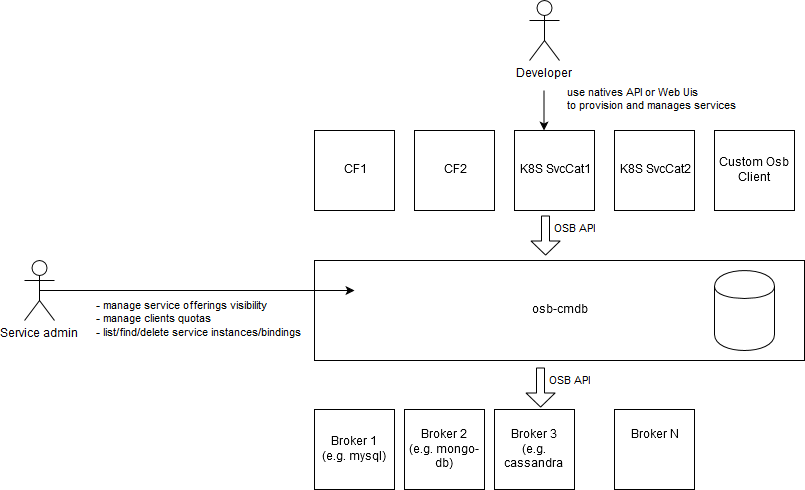
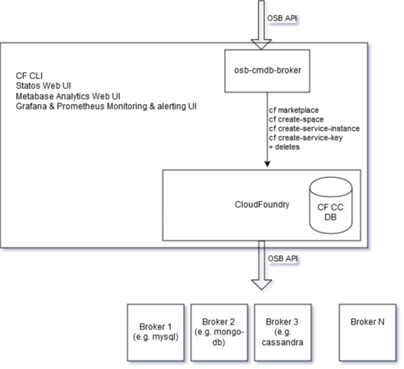

## Osb-cmdb-spike

This repo contains a spike for the osb-cmdb project.

This project provides a configuration management for Open Service Broker API implementation.

At this stage of the spike, this is a fork of the [https://github.com/spring-cloud/spring-cloud-app-broker]( spring-cloud/spring-cloud-app-broker) project (referred as SCAB).

Plan is to work with the SCAB team to contribute upstream osb-cmdb's changes to SCAB, and move osb-cmdb in its own repo which would pull SCAB from maven central.  

### Functional overview

The following diagram presents a functional overview of the ocb-cdmb feature scope

The feature are supported by coarse gain components used by osb-cmdb:

The osb-cdmb service broker translates received osb calls into equivalent CF CC API calls

OSB API endpoint | eq CF CLI UX
------------ | -------------
GET /v2/catalog | cf marketplace (WIP)
PUT /v2/service_instances/:instance_id | cf create-space (WIP) ; cf create-service
GET /v2/service_instances/:instance_id/last_operation | cf service
GET /v2/service_instances/:instance_id | cf service (WIP)
PATCH /v2/service_instances/:instance_id | cf update-service
DELETE /v2/service_instances/:instance_id | cf delete-service
PUT /v2/service_instances/:instance_id/service_bindings/:binding_id | cf create-service-key
GET /v2/service_instances/:instance_id/service_bindings/:binding_id/last_operation | cf get-service-key (WIP)
GET /v2/service_instances/:instance_id/service_bindings/:binding_id | cf get-service-key
DELETE /v2/service_instances/:instance_id/service_bindings/:binding_id | cf delete-service-key

### Releasing

For the spike, 
* manually edit the version in `osb-cmdb/gradle.properties` (e.g `version=0.1.0`), commit & push
* git tag v0.1.0 -a -m "0.1.0 release"
* git push github-orange-osbcmdb-spike  v0.1.0
* let circle ci build and upload the binaries to github
* edit the github release to complete release noets
* manually edit the version in `osb-cmdb/gradle.properties`, commit & push e.g. `version=0.2.0.BUILD-SNAPSHOT` 