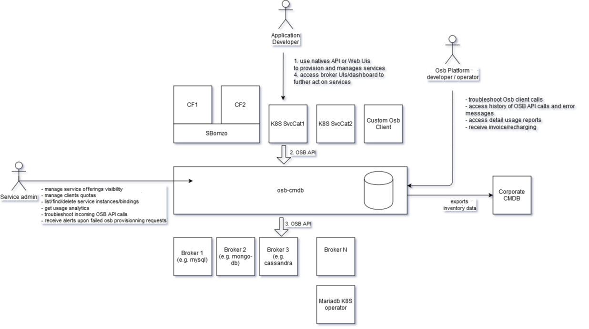

## Osb-cmdb-spike

<!-- 
 TOC generated during https://github.com/ekalinin/github-markdown-toc
cat README.md | /home/guillaume/public-code/github-markdown-toc/gh-md-toc - 
-->

 * [Functional overview](#functional-overview)
 * [Getting started](#getting-started)
    * [Manual catalog of Brokered and backing services](#manual-catalog-of-brokered-and-backing-services)
       * [Backing service instance target strategies](#backing-service-instance-target-strategies)
    * [Typical CMDB content](#typical-cmdb-content)
    * [Dynamic catalog](#dynamic-catalog)
 * [Technical details](#technical-details)
    * [osb-cmdb osb client calls requirements](#osb-cmdb-osb-client-calls-requirements)
    * [Future support for additional meta-data](#future-support-for-additional-meta-data)
    * [Dashboard AuthN and AuthZ support (WIP)](#dashboard-authn-and-authz-support-wip)
       * [Discovery of the OIDC endpoint](#discovery-of-the-oidc-endpoint)
       * [Discovery of the OAuth client_id and client_secret to provision](#discovery-of-the-oauth-client_id-and-client_secret-to-provision)
       * [Dashboard AuthN using OIDC](#dashboard-authn-using-oidc)
       * [Dashboard AuthZ using CF service instance permission](#dashboard-authz-using-cf-service-instance-permission)
       * [Dashboard AuthZ using K8S API](#dashboard-authz-using-k8s-api)
       * [Interaction flow diagram](#interaction-flow-diagram)
 * [Releasing](#releasing)


This repo contains a spike for the osb-cmdb project.

This project provides a configuration management for Open Service Broker API broker implementations. See [orange-cloudfoundry/paas-templates#492](https://github.com/orange-cloudfoundry/paas-templates/issues/492) for more background around use-cases and considered alternatives.

At this stage of the spike, this is a fork of the [spring-cloud/spring-cloud-app-broker](https://github.com/spring-cloud/spring-cloud-app-broker) project (referred as SCAB).

Plan is to work with the SCAB team to contribute upstream osb-cmdb's changes to SCAB, and move osb-cmdb in its own repo which would pull SCAB from maven central, see related issue [spring-cloud/spring-cloud-app-broker/#285](https://github.com/spring-cloud/spring-cloud-app-broker/issues/285) for progress.

### Functional overview

The following diagram presents a functional overview of the ocb-cdmb feature scope


The feature are supported by coarse gain components used by osb-cmdb:


The osb-cdmb service broker translates received osb calls into equivalent CF CC API calls

OSB API endpoint | eq CF CLI UX
------------ | -------------
GET /v2/catalog | cf marketplace
PUT /v2/service_instances/:instance_id | cf create-space ; cf create-service; cf7 set-label; cf7 set-annotation
GET /v2/service_instances/:instance_id/last_operation | cf service
GET /v2/service_instances/:instance_id | cf service (WIP)
PATCH /v2/service_instances/:instance_id | cf update-service
DELETE /v2/service_instances/:instance_id | cf delete-service
PUT /v2/service_instances/:instance_id/service_bindings/:binding_id | cf create-service-key
GET /v2/service_instances/:instance_id/service_bindings/:binding_id/last_operation | cf get-service-key (WIP)
GET /v2/service_instances/:instance_id/service_bindings/:binding_id | cf get-service-key
DELETE /v2/service_instances/:instance_id/service_bindings/:binding_id | cf delete-service-key

### Getting started

Osb-cmdb ships as a spring-boot jar which is configured using properties.

```bash         
curl -L https://github.com/orange-cloudfoundry/osb-cmdb-spike/releases/download/v0.9.0/osb-cmdb-0.9.0.jar -o ./osb-cmdb.jar 
java \
 -Dspring.cloud.appbroker.deployer.cloudfoundry.api-host=api.redacted-domain.org \
 -Dspring.cloud.appbroker.deployer.cloudfoundry.api-port=443 \
 -Dspring.cloud.appbroker.deployer.cloudfoundry.default-org=osb-cmdb-services-org-client-0 \
 -Dspring.cloud.appbroker.deployer.cloudfoundry.default-space=p-mysql \
 -Dspring.cloud.appbroker.deployer.cloudfoundry.username=redacted \
 -Dspring.cloud.appbroker.deployer.cloudfoundry.password=redacted \
 -Dspring.cloud.appbroker.deployer.cloudfoundry.properties.health-check=http \
 -Dspring.cloud.appbroker.deployer.cloudfoundry.properties.health-check-http-endpoint=health \
 -Dspring.cloud.appbroker.deployer.cloudfoundry.properties.health-check-timeout=180 \
 -Dspring.cloud.appbroker.deployer.cloudfoundry.properties.memory=1G \
 -Dspring.security.user.name=user \
 -Dspring.security.user.password=password \
 -Dosbcmdb.admin.user=user \
 -Dosbcmdb.admin.password=password \
 -Dosbcmdb.dynamic-catalog.enabled=true \
 -Dosbcmdb.dynamic-catalog.catalog.services.suffix=suffix \
 -Dosbcmdb.dynamic-catalog.catalog.services.excludeBrokerNamesRegexp=".*cmdb.*" \
 -Dlogging.level.cloudfoundry-client=DEBUG \
 -Dlogging.level.cloudfoundry-client.operations=DEBUG \
 -Dlogging.level.org.springframework.cloud.appbroker=debug \
 -Dlogging.level.org.springframework.cloud.appbroker.deployer.cloudfoundry=debug \
 -Dlogging.level.org.springframework.cloud.servicebroker=debug \
    -jar ./osb-cmdb.jar 
```

The SCAB properties are documented at https://docs.spring.io/spring-cloud-app-broker/docs/current/reference/html5/

Osb-cmdb adds support for additional properties which are illustrated below. Source of truth is associated unit tests, e.g. `SecurityConfigTest`

Osb-cmdb requires two users auth to be configured:
* `spring.security.user`: used for OSB API calls
* `osbcmdb.admin`: used to access sensitive supportability endpoints (powered by springboot actuators)

Osb-Cmdb is expected to be deployed once per OSB client, each having its own basic authentication, its own brokered services catalog, and backend services organization.

#### Manual catalog of Brokered and backing services 

SCAB supports by default user-provided catalog of brokered services, and associated backing services.

Following is an example of a simple SCAB configuration (without detailed catalog customization)

```yaml
#### Manual catalog and brokered service configuration
  spring:
    cloud:
      openservicebroker:
        catalog:
          services:
            - name: p-mysql-cmdb
              id: ebca66fd-461d-415b-bba3-5e379d671c88
              description: A useful service
              bindable: true
              plan_updateable: true
              tags:
                - example
              plans:
                - name: 10mb
                  id: p-mysql-cmdb-10mb
                  description: A standard plan
                  free: true
                - name: 20mb
                  id: p-mysql-cmdb-20mb
                  description: A standard plan
                  free: true
      appbroker:
        services:
          - service-name: p-mysql-cmdb
            plan-name: 10mb
            target:
              name: SpacePerServiceDefinition
            services:
              - service-instance-name: p-mysql
                name: p-mysql
                plan: 10mb
          - service-name: p-mysql-cmdb
            plan-name: 20mb
            target:
              name: SpacePerServiceDefinition
            services:
              - service-instance-name: p-mysql
                name: p-mysql
                plan: 20mb
```


##### Backing service instance target strategies

This configures where backing service instances are created and how they get named.

Beyond built-in [SCAB strategies](https://docs.spring.io/spring-cloud-app-broker/docs/current/reference/html5/#_backing_application_target), Osb-cmdb brings the following additional strategies:
* `SpacePerServicePlan`: 
    * backing service instances are created in dynamically created spaces in the default org, named `${service-definition-name}-${service-plan-name}` 
    * This is useful to apply quota per service plans. However, associated brokered service instances don't support anymore service plan upgrades.   
* `SpacePerServiceDefinition`: 
    * backing service instances are created in dynamically created spaces in the default org, named `${service-definition-name}` 
    * This is useful to apply quota per service definitions.   

#### Typical CMDB content

The following figure displays a hiearchical cloudfoundry org/space/service instance|binding|key organization before osb-cmdb startups with `SpacePerServiceDefinition` strategy 

```
01    ├── osb-cmdb-backend-services-org-client-0 
02    │   ├── default 
04    └── osb-cmdb-smoke-test-brokered-services-org-client-0 
05        ├── smoke-tests      
06        └── default          
```

* 01 holds backend service instances resulting from the client. Expected to be available at startup
* 02 is used by dynamic catalog feature to fetch expected catalog to be brokered for client 0. Expected to be available at startup
* 05 is typically used by paas-templates smoke tests. 05 would be emptied at each test execution. 
* 06 may be used by the embedded CF instance to consume brokered services

Osb-cmdb provides smoke tests in the paas-templates repo that use CF as an OSB client to send OSB API calls to osb-cmdb.

Following consumption of brokered services by smoke tests, spaces/service instances and service keys are dynamically created as described into [Functional overview](#functional-overview) 

```
01    ├── osb-cmdb-backend-services-org-client-0 
02    │   ├── default
03    │   ├── cassandra
04    │   └── mysql
05    │       ├── mysql-service-instance-guid1
06    │       └── mysql-service-key-guid1
07    ├── osb-cmdb-brokered-services-org-client-0 
08        ├── default 
09        └── smoke-tests
10            ├── mysql-service-instance-1
11            └── mysql-service-binding-1
```

* 03, 04 are dynamically created by osb-cmdb
* 10 is a service instance request made with `cf create-service instance mysql-cmdb 10mb myinstance` by smoke tests
    * 05 is the associated backend service in the cmdb
* 11 is a service instance request made with `cf bind-service myapp myinstance` by smoke tests
    * 06 is the associated service key in the cmdb

#### Metadata attached to backing services

In order to provide traceability from backing services to brokered services, the backing service instances are attached the following metadata:

Label name | Label value | Query usage | Read usage
-- | -- | -- | --
backing_service_instance_guid | backing-service-instance-guid | workaround lack of service instance read endpoint |  | 
brokered_service_instance_guid | brokered-service-guid | find a backend service by brokered-service-guid in all orgs/spaces | (redundant with backend service instance name)  | 
brokered_service_context_organization_guid | brokered-service-meta-org-guid | find all backing services for a brokered_service_context_organization_guid | lookup org guid for a given backing service | 
brokered_service_context_space_guid | brokered-service-meta-space-guid | find all backing services for a brokered-service-space-guid | lookup space guid for a given backing service | 
brokered_service_originating_identity_user_id | brokered-service [X-Broker-API-Originating-Identity](https://github.com/openservicebrokerapi/servicebroker/blob/master/profile.md#originating-identity-header) | find all backing services for a brokered-service-user-guid | lookup user guid for a given backing service | 

Annotation name | Annotation value | ~~Query usage~~ (*) | Read usage
-- | -- | -- | --
brokered_service_context_organization_name |  | N/A | lookup org name for a given backing service | 
brokered_service_context_space_name |  | N/A |  lookup space name for a given backing service| 
brokered_service_context_instance_name | | N/A | lookup service instance name for a given backing service | 
brokered_service_api_info_location | [X-Api-Info-Location header](https://docs.cloudfoundry.org/services/supporting-multiple-cf-instances.html#x-api-info-location) | N/A | enforce dashboards authN and authZ | 

(*) annotations can not be queried in CF

To lookup metadata attached to a backing service instance, scripts is available at https://github.com/orange-cloudfoundry/cf-cli-cmdb-scripts to workaround incomplete CF V3 API and CF V7 CLI:

```bash
# Example of a backing service being looked up (corresponding to a brokered service instance provisionned by a CF OSB client)
$ cf s
Getting services in org osb-cmdb-backend-services-org-client-0 / space p-mysql as xx...

name                                           service   plan   bound apps   last operation     broker    upgrade available
p-mysql-3aa96c94-1d01-4389-ab4f-260d99257215   p-mysql   10mb                create succeeded   p-mysql 

$ cf_labels_service p-mysql-80134f9b-b6fd-48e2-8ca5-e185c4cb5ce0
{
    "labels": {
        "brokered_service_instance_guid": "3aa96c94-1d01-4389-ab4f-260d99257215",
        "brokered_service_context_organization_guid": "c2169b61-9360-4d67-968c-575f3a10edf5",
        "brokered_service_originating_identity_user_id": "0d02117b-aa21-43e2-b35e-8ad6f8223519",
        "brokered_service_context_space_guid": "1a603476-a3a1-4c32-8021-d2a7b9b7c6b4",
        "backing_service_instance_guid": "191260bb-3477-422d-8f40-bf053ccf6930"
    },
    "annotations": {
        "brokered_service_context_instance_name": "osb-cmdb-broker-0-smoketest-1578565892",
        "brokered_service_context_space_name": "smoke-tests",
        "brokered_service_api_info_location": "api.mycf.org/v2/info",
        "brokered_service_context_organization_name": "osb-cmdb-brokered-services-org-client-0"
    }
}
```

```
# Example of a backing service being looked up (corresponding to a brokered service instance provisionned by a CF OSB client)
$ cf s
Getting services in org osb-cmdb-backend-services-org-client-0 / space p-mysql as xx...

name                                           service   plan   bound apps   last operation     broker    upgrade available
b6a7a748-6fa5-497c-b111-a3a727ec88db           p-mysql   10mb                create succeeded   p-mysql  

$ cf_labels_service b6a7a748-6fa5-497c-b111-a3a727ec88db
Metadata for service b6a7a748-6fa5-497c-b111-a3a727ec88db:
{
  "labels": {
    "brokered_service_instance_guid": "b6a7a748-6fa5-497c-b111-a3a727ec88db",
    "brokered_service_originating_identity_uid": "",
    "brokered_service_context_namespace": "cloudfoundry-service-instances",
    "backing_service_instance_guid": "6ea3cf73-cbb6-46be-b9c5-dbcf7b04064f"
  },
  "annotations": {
    "brokered_service_originating_identity_extra": "{\"scopes.authorization.openshift.io\":[\"user:full\"]}",
    "brokered_service_originating_identity_username": "a-user-name",
    "brokered_service_originating_identity_groups": "[\"system:authenticated:oauth\",\"system:authenticated\"]"
  }
}
```

The svcat in OpenShift v3.9.51 ( Kubernetes v1.9.1+a0ce1bc657 ), does not provide its internal id (`wbv8r`  in the example below) in its OSB calls.  Correlation from svcat requires looking up the OSB service instance guid, named `ExternalId` into svcat cli

```
$ svcat get instances 
         NAME                     NAMESPACE                  CLASS           PLAN       STATUS  
+---------------------+--------------------------------+---------------+--------------+--------+
  noop-ondemand-jkpn4   cloudfoundry-service-instances   noop-ondemand   mysql-sample   Ready   
  p-mysql-wbv8r         cloudfoundry-service-instances   p-mysql         10mb           Ready  
  
$ svcat describe instance p-mysql-wbv8r -v 9 2>&1 | grep "Response Body" | sed 's/.*Response Body: //' | grep ServiceInstance | jq .spec.externalID
"b6a7a748-6fa5-497c-b111-a3a727ec88db"  

#Lookup in the cmdb a K8S provisionned instance from its externalID

$ cf curl "/v3/service_instances?label_selector=brokered_service_instance_guid==b6a7a748-6fa5-497c-b111-a3a727ec88db" | jq .resources[]
{
  "guid": "6ea3cf73-cbb6-46be-b9c5-dbcf7b04064f",
  "created_at": "2020-02-27T17:35:43Z",
  "updated_at": "2020-02-27T17:35:43Z",
  "name": "b6a7a748-6fa5-497c-b111-a3a727ec88db",
  "relationships": {
    "space": {
      "data": {
        "guid": "38de12e4-3fc8-4698-a8b0-87e7a3dbf2ed"
      }
    }
  },
  "metadata": {
    "labels": {
      "brokered_service_instance_guid": "b6a7a748-6fa5-497c-b111-a3a727ec88db",
      "brokered_service_originating_identity_uid": "",
      "brokered_service_context_namespace": "cloudfoundry-service-instances",
      "backing_service_instance_guid": "6ea3cf73-cbb6-46be-b9c5-dbcf7b04064f"
    },
    "annotations": {
      "brokered_service_originating_identity_extra": "{\"scopes.authorization.openshift.io\":[\"user:full\"]}",
      "brokered_service_originating_identity_username": "a-user-name",
      "brokered_service_originating_identity_groups": "[\"system:authenticated:oauth\",\"system:authenticated\"]"
    }
  },
  "links": {
    "space": {
      "href": "https://api.redacted.com/v3/spaces/38de12e4-3fc8-4698-a8b0-87e7a3dbf2ed"
    }
  }
}

```


#### Dynamic catalog

With large marketplace being brokered, manually maintainaing the catalog might be a tedious task.

Osb-Cmdb brings the feature of dynamic catalog generation which can be opted-in as follows. 

At start up, the broker will fetch the service definitions from the target CF instance, as visible from the default organization and space (the equivalent of the `cf marketplace`command). For now service plan visibility is not fetched.

As a result, a catalog of Brokered services is generated with a one-to-one mapping between brokered services and backing services. 
The following properties can be used to tune this mapping:

```yaml
  osbcmdb:
    dynamic-catalog:
      enabled: "true" #Turn on dynamic catalog. Catalog and brokered services properties 
      catalog:
        services:
          suffix: "-cmdb" #Suffix to add each service definition
          excludeBrokerNamesRegexp: ".*cmdb.*" # Excludes broker names matching this regexp. Good to excluding osb-cmdb itself to avoid brokering itself. 
```

Additionally, the generated catalog is dumped on disk onto `/tmp/osb-cmdb-dynamicCatalog.yml` (see org.springframework.cloud.appbroker.autoconfigure.ServiceConfigurationYamlDumper)

This can be used as a baseline for manually tuned catalog when supported tunings in automated generation are insufficient.  

### Technical details

#### osb-cmdb osb client calls requirements

The OSB API specifications available at https://github.com/openservicebrokerapi/servicebroker/blob/master/spec.md are versatile and support multiple extensions. See https://github.com/openservicebrokerapi/servicebroker/blob/master/diagram.md for a visual overview.

This section lists the requirements that osb clients need to comply with in order to consumme services exposed by osb-cmdb.

- The osb-cmdb expects OSB API calls matching OSB specification version 2.14 (this version will be updated in the future)
- The cloudfoundry profile described at https://github.com/openservicebrokerapi/servicebroker/blob/master/profile.md MUST be used with the possible following relaxations
   - The following fields are mandatory but may have fake, non empty values e.g. "na"
       - organization_guid
       - organization_name
       - space_guid
       - space_name
       - instance_name
- The client MUST support asynchronous service instance provisionning (see https://github.com/openservicebrokerapi/servicebroker/blob/master/spec.md#asynchronous-operations), i.e. provide the query parameter accepts_incomplete=true
   - Service binding MAY only support blocking operation and specify the query parameter accepts_incomplete=false

#### Future support for additional meta-data

Once OSB 2.16 version gets released and supported by osb-cmdb, the following additional fields MAY be used by clients to fill in arbitrary meta-data associated with service instances, see https://github.com/openservicebrokerapi/servicebroker/pull/658 for background:
- instance_annotations
- space_annotations
- organization_annotations

These annotations get propagated into service monitoring/alerts.

#### Dashboard AuthN and AuthZ support (WIP)

UIs/Dashboard presented to developers (e.g. quotas and in the future backup/restore and monitoring) use OpenIdConnect (https://openid.net/specs/openid-connect-core-1_0.html) for user authentication (AuthN) and a REST endpoint for authorization (AuthZ). This is inspired from https://docs.cloudfoundry.org/services/dashboard-sso.html

##### Discovery of the OIDC endpoint

This section below detail how osb-cmdb discovers the OIDC and AuthZ from Osb API calls:

Osb-cmdb expects to receive the X-Api-Info-Location header in all OSB API calls. This header documented at https://docs.cloudfoundry.org/services/supporting-multiple-cf-instances.html (until this header makes it into the OSB API, see cf https://github.com/openservicebrokerapi/servicebroker/pull/686 )
 
The X-Api-Info-Location header MUST return a Url (similar to https://api.cloudfoundry.redacted-domain.org/v2/info ) whose response should have header « Content-Type: application/json;charset=utf-8 » and a body at least containing the following field keys, (and appropriate values).
 
{  "authorization_endpoint": "https://login.redacted-domain.org",
  "token_endpoint": "https://uaa.redacted-domain.org",
}

These 2 fields provide access to OIDC authorization and token endpoints.

##### Discovery of the OAuth client_id and client_secret to provision

The clients are expected to comply with the Cloudfoundry catalogue extension documented at https://github.com/openservicebrokerapi/servicebroker/blob/master/profile.md#cloud-foundry-catalog-extensions with an extract reproduced below.

{
  "services": [{
    "name": "fake-service",
    "id": "acb56d7c-XXXX-XXXX-XXXX-feb140a59a66",
    "description": "A fake service.",
    "dashboard_client": {
      "id": "398e2f8e-XXXX-XXXX-XXXX-19a71ecbcf64",
      "secret": "277cabb0-XXXX-XXXX-XXXX-7822c0a90e5d",
      "redirect_uri": "http://localhost:1234"
    }
  }]
}

Clients are expected to provision an OAuth2 client matching the id/secret and restrict http redirections to the specified redirect_uri.

##### Dashboard AuthN using OIDC

The OSB-CMDB directs users into an Oauth2 authorization grant flow (see https://tools.ietf.org/html/rfc6749#section-4.1 and CF UAA implementation at https://docs.cloudfoundry.org/api/uaa/version/74.4.0/index.html#authorization-code-grant ) with the following authorize endpoint parameters

    response_type= code
    client_id: the oauth client claimed in the catalog cloudfoundry extension described above.
    redirect_uri
    scope=cloud_controller_service_permissions.read openid
    state
    nonce


This authorization grant flow grants the OSB-CMDB with an access token which is then used for invoking the authorization REST endpoint.

This authorization grant flow may also provide the OSB-CMDB with an OIDC id token, used to fetch developer identity (in Id token standard claims https://openid.net/specs/openid-connect-core-1_0.html#StandardClaims or UserInfo endpoint https://openid.net/specs/openid-connect-core-1_0.html#UserInfo ). This may be used in the future in audit events.


Below is an extract from the OAuth2 specifications describing the authorization grant flow interactions

     +----------+
     | Resource |
     |   Owner  |
     |          |
     +----------+
          ^
          |
         (B)
     +----|-----+          Client Identifier      +---------------+
     |         -+----(A)-- & Redirection URI ---->|               |
     |  User-   |                                 | Authorization |
     |  Agent  -+----(B)-- User authenticates --->|     Server    |
     |          |                                 |               |
     |         -+----(C)-- Authorization Code ---<|               |
     +-|----|---+                                 +---------------+
       |    |                                         ^      v
      (A)  (C)                                        |      |
       |    |                                         |      |
       ^    v                                         |      |
     +---------+                                      |      |
     |         |>---(D)-- Authorization Code ---------'      |
     |  Client |          & Redirection URI                  |
     |         |                                             |
     |         |<---(E)----- Access Token -------------------'
     +---------+       (w/ Optional Refresh Token)

       Note: The lines illustrating steps (A), (B), and (C) are broken into
       two parts as they pass through the user-agent.

                     Figure 3: Authorization Code Flow

       The flow illustrated in Figure 3 includes the following steps:
    
       (A)  The client initiates the flow by directing the resource owner's
            user-agent to the authorization endpoint.  The client includes
            its client identifier, requested scope, local state, and a
            redirection URI to which the authorization server will send the
            user-agent back once access is granted (or denied).
    
       (B)  The authorization server authenticates the resource owner (via
            the user-agent) and establishes whether the resource owner
            grants or denies the client's access request.
    
       (C)  Assuming the resource owner grants access, the authorization
            server redirects the user-agent back to the client using the
            redirection URI provided earlier (in the request or during
            client registration).  The redirection URI includes an
            authorization code and any local state provided by the client
            earlier.
    
       (D)  The client requests an access token from the authorization
            server's token endpoint by including the authorization code
            received in the previous step.  When making the request, the
            client authenticates with the authorization server.  The client
            includes the redirection URI used to obtain the authorization
            code for verification.
    
       (E)  The authorization server authenticates the client, validates the
            authorization code, and ensures that the redirection URI
            received matches the URI used to redirect the client in
            step (C).  If valid, the authorization server responds back with
            an access token and, optionally, a refresh token.


##### Dashboard AuthZ using CF service instance permission

A distinct AuthZ endpoint GET /v2/service_instances/:guid/permissions (matching https://apidocs.cloudfoundry.org/12.1.0/service_instances/retrieving_permissions_on_a_service_instance.html ) MUST be supported and available at the same FQDN than the Url retourned by the X-Api-Info-Location header.

This endpoint will receive a JWT OAuth2 bearer access token provided by developers browser in its web session when accessing the dashboard (see section above)
 
The osb-cmdb will authenticate users accessing dashboards using OIDC and the AuthZ endpoint.
The user AuthZ will be performed according to the AuthZ endpoint response which MUST respond with the following JSON formatted response
 
{
  "manage": true,
  "read": true
}
##### Dashboard AuthZ using K8S API

When a K8S OSB client (such as service catalog) requires authorization of K8S users, the osb-cmdb plans to leverage the K8S SubjectAccessReview webhook https://kubernetes.io/docs/reference/access-authn-authz/webhook/#request-payloads for checking the permissions of SVCat resource associated wth the OSB provisionned service instance


##### Interaction flow diagram

The following diagram summarizes the interactions between OSB-CMDB and its clients (inspired by https://gist.github.com/hrchu/d88efb56e72534a1233d16f36eb3e3e9)


### Contributing

#### Circle ci tests

Circle ci tests run offline without a cloudfoundry instance. They include scab tests and osb-cmdb tests. See osb-cmdb/.circle/config.yml

#### Acceptance tests

Acceptance tests run privately against a live cloudfoundry instance. Tests are private because it is hard to secure logs to not leak credentials that could be used to abuse the Cloud Foundry instance.

See https://github.com/orange-cloudfoundry/osb-cmdb-ci for the concourse task running the acceptance tests.

Like scab, osb-cmdb acceptance tests use distinct properties than osb-cmdb production properties. Refer to [Getting started](#getting-started) for the list of prod properties supported, and paas-templates smoke tests. 

#### Releasing

For the spike, 
* manually edit the version in `osb-cmdb/gradle.properties` (e.g `version=0.1.0`), commit & push
* git tag v0.1.0 -a -m "0.1.0 release"
* git push github-orange-osbcmdb-spike  v0.1.0
* let circle ci build and upload the binaries to github
* edit the github release to complete release noets
* manually edit the version in `osb-cmdb/gradle.properties`, commit & push e.g. `version=0.2.0.BUILD-SNAPSHOT` 
