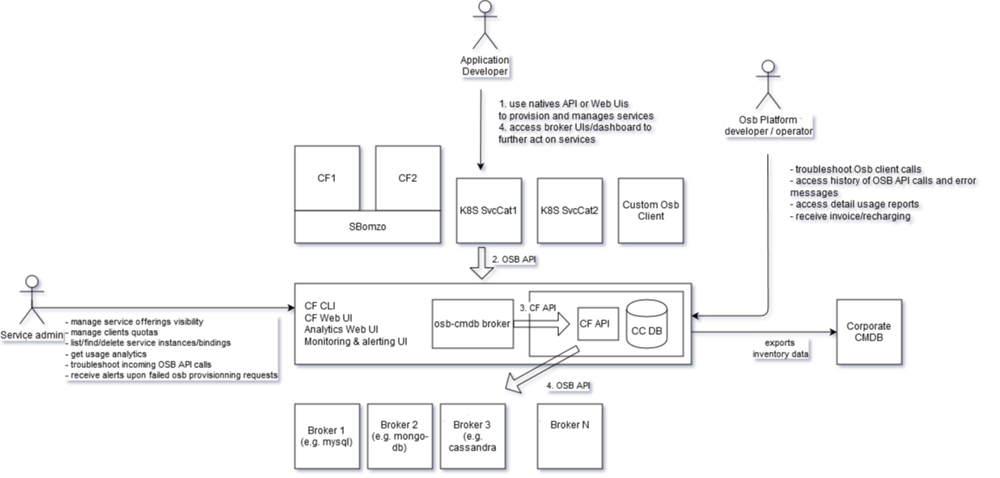

## Osb-cmdb-spike

This repo contains a spike for the osb-cmdb project.

This project provides a configuration management for Open Service Broker API broker implementations. See [orange-cloudfoundry/paas-templates#492](https://github.com/orange-cloudfoundry/paas-templates/issues/492) for more background around use-cases and considered alternatives.

At this stage of the spike, this is a fork of the [https://github.com/spring-cloud/spring-cloud-app-broker]( spring-cloud/spring-cloud-app-broker) project (referred as SCAB).

Plan is to work with the SCAB team to contribute upstream osb-cmdb's changes to SCAB, and move osb-cmdb in its own repo which would pull SCAB from maven central, see related issue [spring-cloud/spring-cloud-app-broker/#285](https://github.com/spring-cloud/spring-cloud-app-broker/issues/285) for progress.

### Functional overview

The following diagram presents a functional overview of the ocb-cdmb feature scope

The feature are supported by coarse gain components used by osb-cmdb:

The osb-cdmb service broker translates received osb calls into equivalent CF CC API calls

OSB API endpoint | eq CF CLI UX
------------ | -------------
GET /v2/catalog | cf marketplace
PUT /v2/service_instances/:instance_id | cf create-space ; cf create-service
GET /v2/service_instances/:instance_id/last_operation | cf service
GET /v2/service_instances/:instance_id | cf service (WIP)
PATCH /v2/service_instances/:instance_id | cf update-service
DELETE /v2/service_instances/:instance_id | cf delete-service
PUT /v2/service_instances/:instance_id/service_bindings/:binding_id | cf create-service-key
GET /v2/service_instances/:instance_id/service_bindings/:binding_id/last_operation | cf get-service-key (WIP)
GET /v2/service_instances/:instance_id/service_bindings/:binding_id | cf get-service-key
DELETE /v2/service_instances/:instance_id/service_bindings/:binding_id | cf delete-service-key

### Technical details

#### osb-cmdb osb client calls requirements

The OSB API specifications available at https://github.com/openservicebrokerapi/servicebroker/blob/master/spec.md are versatile and support multiple extensions. See https://github.com/openservicebrokerapi/servicebroker/blob/master/diagram.md for a visual overview.

This section lists the requirements that osb clients need to comply with in order to consumme services exposed by osb-cmdb.

- The osb-cmdb expects OSB API calls matching OSB specification version 2.14 (this version will be updated in the future)
- The cloudfoundry profile described at https://github.com/openservicebrokerapi/servicebroker/blob/master/profile.md MUST be used with the possible following relaxations
   - The following fields are mandatory but may have fake, non empty values e.g. "na"
       - organization_guid
       - organization_name
       - space_guid
       - space_name
       - instance_name
- The client MUST support asynchronous service instance provisionning (see https://github.com/openservicebrokerapi/servicebroker/blob/master/spec.md#asynchronous-operations), i.e. provide the query parameter accepts_incomplete=true
   - Service binding MAY only support blocking operation and specify the query parameter accepts_incomplete=false

#### Future support for additional meta-data

Once OSB 2.16 version gets released and supported by osb-cmdb, the following additional fields MAY be used by clients to fill in arbitrary meta-data associated with service instances, see https://github.com/openservicebrokerapi/servicebroker/pull/658 for background:
- instance_annotations
- space_annotations
- organization_annotations

These annotations get propagated into service monitoring/alerts.

#### Dashboard AuthN and AuthZ support (WIP)

UIs/Dashboard presented to developers (e.g. quotas and in the future backup/restore and monitoring) use OpenIdConnect (https://openid.net/specs/openid-connect-core-1_0.html) for user authentication (AuthN) and a REST endpoint for authorization (AuthZ). This is inspired from https://docs.cloudfoundry.org/services/dashboard-sso.html

##### Discovery of the OIDC endpoint

This section below detail how osb-cmdb discovers the OIDC and AuthZ from Osb API calls:

Osb-cmdb expects to receive the X-Api-Info-Location header in all OSB API calls. This header documented at https://docs.cloudfoundry.org/services/supporting-multiple-cf-instances.html (until this header makes it into the OSB API, see cf https://github.com/openservicebrokerapi/servicebroker/pull/686 )
 
The X-Api-Info-Location header MUST return a Url (similar to https://api.cloudfoundry.redacted-domain.org/v2/info ) whose response should have header « Content-Type: application/json;charset=utf-8 » and a body at least containing the following field keys, (and appropriate values).
 
{  "authorization_endpoint": "https://login.redacted-domain.org",
  "token_endpoint": "https://uaa.redacted-domain.org",
}

These 2 fields provide access to OIDC authorization and token endpoints.

##### Discovery of the OAuth client_id and client_secret to provision

The clients are expected to comply with the Cloudfoundry catalogue extension documented at https://github.com/openservicebrokerapi/servicebroker/blob/master/profile.md#cloud-foundry-catalog-extensions with an extract reproduced below.

{
  "services": [{
    "name": "fake-service",
    "id": "acb56d7c-XXXX-XXXX-XXXX-feb140a59a66",
    "description": "A fake service.",
    "dashboard_client": {
      "id": "398e2f8e-XXXX-XXXX-XXXX-19a71ecbcf64",
      "secret": "277cabb0-XXXX-XXXX-XXXX-7822c0a90e5d",
      "redirect_uri": "http://localhost:1234"
    }
  }]
}

Clients are expected to provision an OAuth2 client matching the id/secret and restrict http redirections to the specified redirect_uri.

##### Dashboard AuthN using OIDC

The OSB-CMDB directs users into an Oauth2 authorization grant flow (see https://tools.ietf.org/html/rfc6749#section-4.1 and CF UAA implementation at http://docs.cloudfoundry.org/api/uaa/version/74.4.0/index.html#authorization-code-grant ) with the following authorize endpoint parameters

    response_type= code
    client_id: the oauth client claimed in the catalog cloudfoundry extension described above.
    redirect_uri
    scope=cloud_controller_service_permissions.read openid
    state
    nonce

This authorization grant flow grants the OSB-CMDB with an access token which is then used for invoking the authorization REST endpoint.

This authorization grant flow may also provide the OSB-CMDB with an OIDC id token, used to fetch developer identity (in Id token standard claims https://openid.net/specs/openid-connect-core-1_0.html#StandardClaims or UserInfo endpoint https://openid.net/specs/openid-connect-core-1_0.html#UserInfo ). This may be used in the future in audit events.

Below is an extract from the OAuth2 specifications describing the authorization grant flow interactions

     +----------+
     | Resource |
     |   Owner  |
     |          |
     +----------+
          ^
          |
         (B)
     +----|-----+          Client Identifier      +---------------+
     |         -+----(A)-- & Redirection URI ---->|               |
     |  User-   |                                 | Authorization |
     |  Agent  -+----(B)-- User authenticates --->|     Server    |
     |          |                                 |               |
     |         -+----(C)-- Authorization Code ---<|               |
     +-|----|---+                                 +---------------+
       |    |                                         ^      v
      (A)  (C)                                        |      |
       |    |                                         |      |
       ^    v                                         |      |
     +---------+                                      |      |
     |         |>---(D)-- Authorization Code ---------'      |
     |  Client |          & Redirection URI                  |
     |         |                                             |
     |         |<---(E)----- Access Token -------------------'
     +---------+       (w/ Optional Refresh Token)

       Note: The lines illustrating steps (A), (B), and (C) are broken into
       two parts as they pass through the user-agent.

                     Figure 3: Authorization Code Flow

       The flow illustrated in Figure 3 includes the following steps:
    
       (A)  The client initiates the flow by directing the resource owner's
            user-agent to the authorization endpoint.  The client includes
            its client identifier, requested scope, local state, and a
            redirection URI to which the authorization server will send the
            user-agent back once access is granted (or denied).
    
       (B)  The authorization server authenticates the resource owner (via
            the user-agent) and establishes whether the resource owner
            grants or denies the client's access request.
    
       (C)  Assuming the resource owner grants access, the authorization
            server redirects the user-agent back to the client using the
            redirection URI provided earlier (in the request or during
            client registration).  The redirection URI includes an
            authorization code and any local state provided by the client
            earlier.
    
       (D)  The client requests an access token from the authorization
            server's token endpoint by including the authorization code
            received in the previous step.  When making the request, the
            client authenticates with the authorization server.  The client
            includes the redirection URI used to obtain the authorization
            code for verification.
    
       (E)  The authorization server authenticates the client, validates the
            authorization code, and ensures that the redirection URI
            received matches the URI used to redirect the client in
            step (C).  If valid, the authorization server responds back with
            an access token and, optionally, a refresh token.

##### Dashboard AuthZ using CF service instance permission

A distinct AuthZ endpoint GET /v2/service_instances/:guid/permissions (matching https://apidocs.cloudfoundry.org/12.1.0/service_instances/retrieving_permissions_on_a_service_instance.html ) MUST be supported and available at the same FQDN than the Url retourned by the X-Api-Info-Location header.

This endpoint will receive a JWT OAuth2 bearer access token provided by developers browser in its web session when accessing the dashboard (see section above)
 
The osb-cmdb will authenticate users accessing dashboards using OIDC and the AuthZ endpoint.
The user AuthZ will be performed according to the AuthZ endpoint response which MUST respond with the following JSON formatted response
 
{
  "manage": true,
  "read": true
}
##### Dashboard AuthZ using K8S API

When a K8S OSB client (such as service catalog) requires authorization of K8S users, the osb-cmdb plans to leverage the K8S SubjectAccessReview webhook https://kubernetes.io/docs/reference/access-authn-authz/webhook/#request-payloads for checking the permissions of SVCat resource associated wth the OSB provisionned service instance

##### Interaction flow diagram

The following diagram summarizes the interactions between OSB-CMDB and its clients (inspired by https://gist.github.com/hrchu/d88efb56e72534a1233d16f36eb3e3e9)

### Releasing

For the spike, 
* manually edit the version in `osb-cmdb/gradle.properties` (e.g `version=0.1.0`), commit & push
* git tag v0.1.0 -a -m "0.1.0 release"
* git push github-orange-osbcmdb-spike  v0.1.0
* let circle ci build and upload the binaries to github
* edit the github release to complete release noets
* manually edit the version in `osb-cmdb/gradle.properties`, commit & push e.g. `version=0.2.0.BUILD-SNAPSHOT` 
